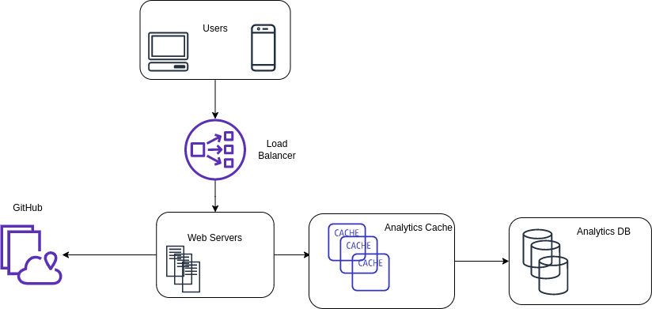

# gh-stats
This is a proof of concept of a GitHub analytics service.

## Requirements
- Given a range of days, return list of project contributors alongside the number of commits they authored each day.
- Given a specific day and user, return a list of commits for the user on that day.

## Non-Functional Requirements
- Internal company tool
- Daily active users: ~30 

## API Endpoints
- Count Daily Commits: `/api/v1/repos/{owner}/{repo}/stats/daily_commits?author=X&page=1&per_page=[1, 5]&start_day=YYYY-MM-DD&end_day=YYYY-MM-DD`
- Get Commits: `/api/v1/repos/{owner}/{repo}/commits?author=X&page=1&per_page=[1, 100]&start_day=YYYY-MM-DD&end_day=YYYY-MM-DD`

After running the local development server, full API documentation is generated and available on: 
- http://localhost:8000/docs 
- http://localhost:8000/redocs

## Installation
1. `python -m venv venv` to create a  virtualenv
2. `. venv/bin/activate` to enable the virtualenv 
3. `./install.sh` to install the required Python dependencies which are listed in `requirements.txt`
4. `./start_server.sh` to start the local development server on localhost:8000

## Running Tests
1. Run `pytest` on the base project directory

## GitHub Authentication
GitHub's unauthenticated rate limit is very low: only 60 requests/hour. Thus, it's recommended that you generate a PAT (Personal Access Token) to increase this to 5,000 requests/hour.

1. Follow this guide to get your token with at least repo permissions: https://docs.github.com/en/authentication/keeping-your-account-and-data-secure/creating-a-personal-access-token
2. Create a file named `.ghstatsrc` in your home user directory containing just your generated token

## Design Summary
- Built with FastAPI, which gives us out of the box support for asyncio and generated API documentation
- API is defined in `routers/commits.py`
- API uses `GitHubFacade` to communicate with GitHub. `GitHubFacade` abstracts peculiarities of the GitHub API.
- `GitHubFacade` depends on `GitHubService` which can be either the GitHub API or a mock of it.

## Project Structure
```
app/
-- github/      # communication with GitHub API
-- models/      # models used in our service API
-- routers/     # API endpoints
-- tests/       # integration and e2e tests
dependencies.py # FastAPI dependency injection setup
main.py         # app entrypoint
```

## Opportunities for Improvement
As with any software project, there are many opportunies for improvement. Here are some interesting ones:

- Improve typing hints in GitHubService
- The proper way to authenticate for an app like this would be to register it as GitHub App instead of using a personal access token
- Improve test coverage: add more tests for unhappy paths and edge cases
- Use httpx in tests to enable async tests
- Refactor common API parameters (owner, repo, per_page, page) into a reusable dependency
- Improve error validation when retrieving and parsing data from GitHub API
- Cache GitHub API responses
- GitHub GraphQL API might yield faster performance than REST
- Containerize and setup deployment as serverless app (e.g. AWS Lambda)
- The service would likely need to support more complex queries in the future, so it should have its own analytics database instead of hitting GitHub API every time.

## Future High-level Architecture Idea
Currently, we just have a single server passing most of the workload to the GitHub API. This is not scalable considering the complexity of analytics queries and GitHub's API limits.

If this service is intended to grow as an analytics tool, we would likely have something like this in the future:




